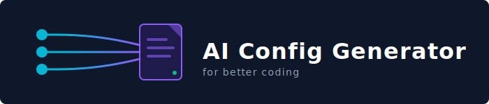

<p align="center">
  
</p>

<p align="center">
  <em>Enterprise-grade configuration generator for AI coding assistants</em>
</p>

<p align="center">
  
  
  
  
</p>

---

**aicgen** makes your project AI-ready in seconds. It uses **LLMs (Claude, Gemini, OpenAI)** to analyze your codebase and automatically generate the perfect instruction files for your AI coding assistant.

## ✨ Features

- **🧠 AI-Powered Analysis** - Uses Claude, Gemini, or GPT-4o to scan your project structure and suggest the perfect configuration.
- **🎯 Multi-Assistant Support** - Claude Code, GitHub Copilot, Gemini, Antigravity, Codex.
- **🔐 Auto-Credential Resolution** - Automatically detects your existing `ANTHROPIC_API_KEY`, `OPENAI_API_KEY`, or Google Cloud credentials (ADC).
- **📚 60+ Guidelines** - Organized into 12 categories (Language, Architecture, Testing, Security, etc.).
- **🎨 Enterprise CLI Experience** - Professional UI with interactive wizards and smart defaults.
- **⚡ Hooks & Sub-Agents** - Auto-generates Claude Code hooks and verification agents.
- **🏗️ Architecture Aware** - Distinguishes between Microservices, Modular Monoliths, and simple scripts.
- **📦 Zero Dependencies** - All guideline data is embedded in the binary.

## 🚀 Quick Start

### 1. Set your API Key (Optional but Recommended)
aicgen can use your existing keys to analyze your project.

```bash
# Claude
export ANTHROPIC_API_KEY=sk-...
# OR use existing ~/.claude/.credentials.json login

# Gemini
export GEMINI_API_KEY=...
# OR use gcloud auth application-default login

# OpenAI
export OPENAI_API_KEY=sk-...
```

### 2. Run Init
Navigate to your project and run:

```bash
aicgen init
```

The CLI will:
1.  Detect your API keys.
2.  Ask to **✨ Analyze project structure with AI?**
3.  Scan your file tree and key configs (package.json, go.mod, etc.).
4.  Suggest the best **Language**, **Project Type**, and **Architecture**.
5.  Generate the `.claude/`, `.github/`, or `.agent/` config files.

---

## 📦 Installation

### From Binary (Recommended)

Download the latest binary for your platform from the [releases page](https://github.com/aicgen/aicgen/releases):

- **Windows**: `aicgen.exe`
- **Linux**: `aicgen-linux`
- **macOS**: `aicgen-macos`

```bash
# Windows
.\aicgen.exe init
```

### From Source

```bash
git clone https://github.com/aicgen/aicgen.git
cd aicgen
bun install
bun run build:binary
bun run start init
```

---

## 🧠 AI Integration Details

aicgen's "Phase 2" engine uses intelligent context gathering to make setting up a complex project easy.

| Provider | Requirement | Detection Method |
| :--- | :--- | :--- |
| **Claude** | `@anthropic-ai/claude-agent-sdk` | `ANTHROPIC_API_KEY` env or `~/.claude/` credentials. |
| **Gemini** | `@google/generative-ai` | `GEMINI_API_KEY` env or Google ADC (`gcloud`). |
| **OpenAI** | `openai` | `OPENAI_API_KEY` env. |

**Privacy Note:** aicgen sends a *summary* of your file tree and content from public config files (like `package.json`, `README.md`) to the LLM. It does **not** upload your entire source code.

---

## 📚 Guideline System

aicgen uses a **modular guideline architecture** with **60+ markdown guidelines** organized into **12 categories**.

```bash
# View guideline statistics
aicgen stats
```

**Categories:**
- **Language** - TypeScript, Python, Go, Rust, Java, C#, Ruby, JavaScript
- **Architecture** - Layered, Modular Monolith, Microservices, Event-Driven, Hexagonal
- **DevOps** - CI/CD, Docker, Observability (Log formats, Metrics)
- **Best Practices** - SOLID, DRY, Clean Code principles
- And more...

## 📁 Generated Outputs

### For Claude Code
```text
.claude/
├── CLAUDE.md                  # Master instructions
├── settings.json              # Hooks & permissions
├── guidelines/                # Modular guidelines
│   ├── clean-architecture.md
│   ├── typescript.md
│   └── ...
└── agents/                    # Sub-agents
    └── guideline-checker.md
```

### For GitHub Copilot
```text
.github/
├── copilot-instructions.md    # Master instructions
└── instructions/              # Topic-specific files
```

### For Gemini / Antigravity
```text
.gemini/                       # or .agent/
└── instructions.md            # Consolidated system prompt
```

---

## 🗺️ Roadmap

### ✅ Completed

- [x] **Phase 1: Foundation**
  - [x] Project fingerprinting (Regex/File extraction)
  - [x] Profile system & Handlebars templating
- [x] **Phase 1.5: Content Refinement**
  - [x] Polyglot guidelines (Language-agnostic architecture concepts)
  - [x] Legacy data cleanup
- [x] **Phase 2: AI Integration**
  - [x] AI-powered project analysis
  - [x] Smart Auto-Configuration
  - [x] Provider Agnostic (Claude, Gemini, OpenAI)

### 🚧 Future Enhancements

- [ ] **Phase 3: Deep Customization**
  - [ ] "Fix my code" agent using generated guidelines
  - [ ] Custom validation hooks
  - [ ] npm publishing

## 🤝 Contributing

Contributions are welcome! Please see [CONTRIBUTING.md](CONTRIBUTING.md) for details.

## 📄 License

MIT © 2025
